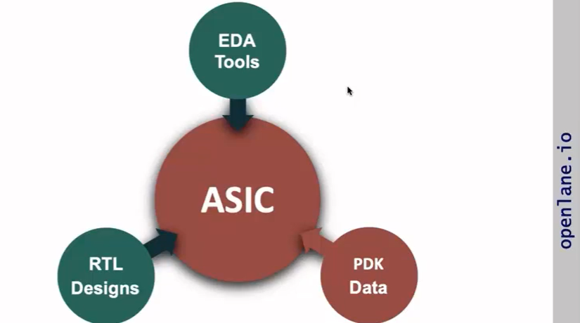
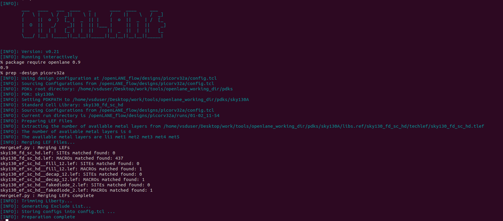
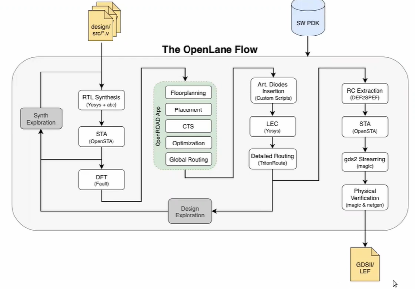
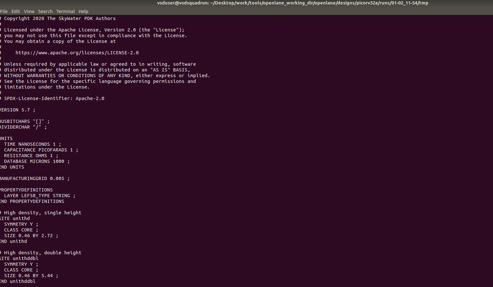
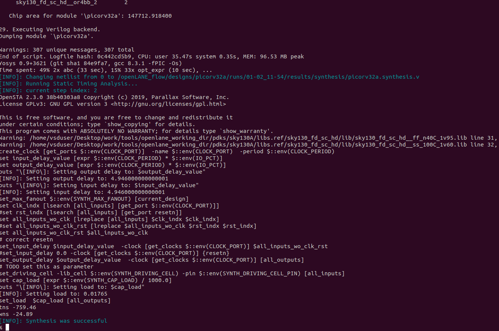
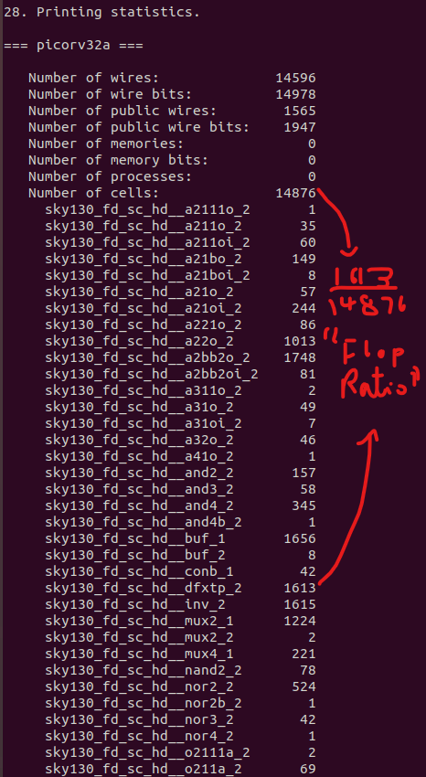
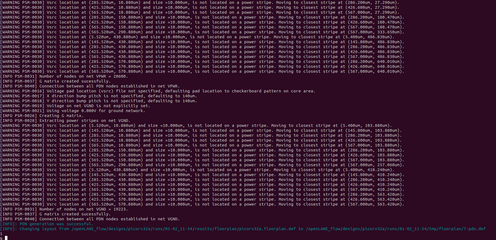
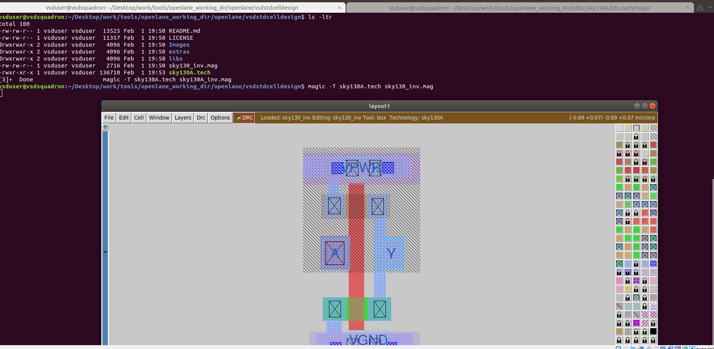

# VSD-SOC_Workshop
Hi!
In this GitHub repo, I will walk you through all the steps required to design chips online using your laptop!
## Getting Started with OpenLane 
To load OpenLane on your system we must install *Oracle VM VirtualBox* Which allows you to open several operating systems on your computer regardless of which operating system and version. Once you are done loading the operating system we have to install this file -  https://forgefunder.com/~kunal/vsdsquadron.vdi <---

Once you are done, navigate to openlane_wokring_dir in the Terminal and type docker to start openlane:

*To merge all the picorv files type prep -design picorv32a* **Check Above**

### More info:

## Check if you have successfully done all the starting steps!

-_-

Go to openlane/designs/picorv32a/runs/**The date of the run(You need to do the starting steps again if you are creating a new run <a href="#starting">Here</a>)**/tmp/merged.lef
*The output in merged.lef*:

## Run synthesis
Type run_synthesis in the openlane bash:

Additionally, you can check the flop ratio which is the **d flip flop/number of cells** which is visible in the synthesis output near to the end:

*1612/14876* = **0.1084** or **10.84%**

### Check synthesis results
Go to this folder which we have seen before-
<a href="#go">You might have seen this folder before!</a>
And in the runs/**Date(See <a href="#go">Here</a>)**/reports/synthesis/**last yosys report**
You can also check the opensta report!

## Running FloorPlan!
Once you are done with the above steps type run_floorplan in the bash!

### Check results again *sigh--*
Go to logs/floorplan/ioPlacer.log in the runs folder in the date.

## After running the magic app in the folder
magic -T
### Io placer revision
after floorplan, you can run this

Check the magic tab again by doing magic -T again

## Git cloning the sample cell
git clone - https://github.com/nickson-jose/vsdstdcelldesign.git
once you are done with that copy the skt130A.tech file from magic

## Viewing the new cells
Once you are done copying the file type the magic command 

